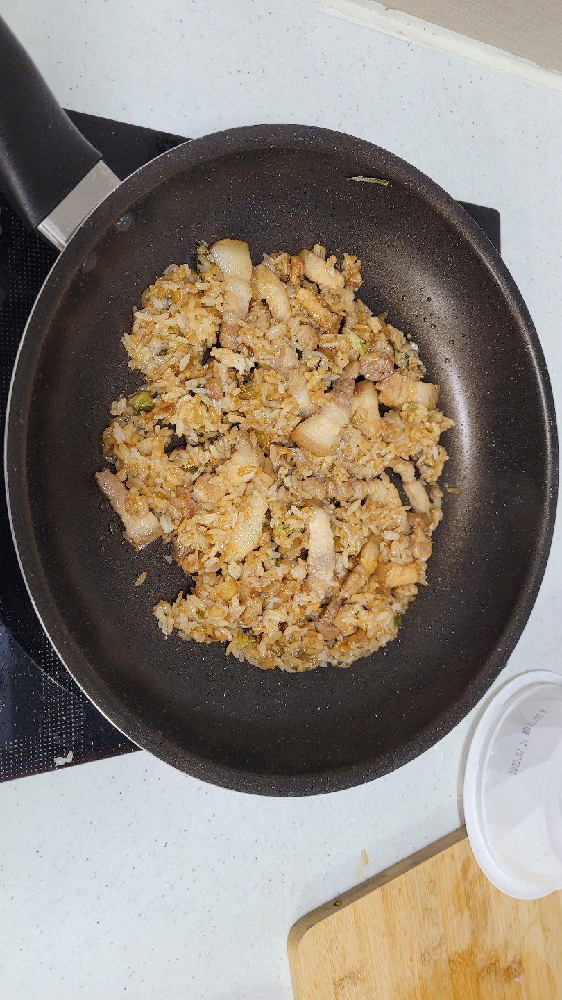

# 기름 범벅 삼결살 볶음밥

## 재료

- 파 - 적당히 취향껏
- 양파 - 적당히 취향껏
- 마늘 - 적당히 취향껏 (나는 밥 한숫갈 정도)
- 삼겹살 - 한줄 (약 150g)
- 햇반(or 오뚜기밥 or 밥한공기) - 1개
- 간장 - 밥 두숫갈
- 설탕 - 밥 반숫갈
- **(핵심)** 식용유 - 후라이팬 3바퀴

## 요리 방법

1. 먼저 후라이팬에 `기름(식용유)`을 3바퀴 정도 두른다.
2. 삼겹살을 먹기 좋은 크기(취향대로)로 썰어준다. 
   - 얼어있는 경우 해동해준다. (전자레인지 해동 모드 2분)
3. 미리 개량해둔 `파`, `양파`, `마늘(이하 파양마)`을 한번에 투척한 후 볶아준다.
4. `양파`가 **살짝 노릇노릇** 해졌으면 다른 한쪽에 `간장 두숫갈`을 먼저 넣고 조금 끓어 기포가 올라올 때 `설탕 한숫갈`을  간장 위에 부어 **녹여준다**.
5. `설탕이 녹은 간장(이하 설녹간)`을 미리 볶아둔 `파양마(파, 양파, 마늘)`와 볶아준다.
6. 대충 양파가 갈색이 될때 쯤 미리 썰어둔 삼겹살을 투척한 후 복아준다.
7. 삼겹살이 익었다고 판단될 때 햇반을 투하한다. 이때 핵심은 햇반은 10초 정도 돌린 상태거나 그냥 뜯자마자의 날것을 넣어준다.
   - 어차피 햇반은 이미 다 되어있는 밥이기 때문에 상관 없다.
8. 취향껏 볶아준다.
9. 먹는다.

## 최종 평가

- 맛 : ★★★☆☆
  - 이유 : 첫 끼라 배가 많이 고팠다. 평소였으면 더 낮았을 듯하다.

- 생애 첫 볶음밥이었는데(간계밥 제외) 생각보다 기름이 많아 느끼했다. 하지만 펩시와 함께 먹으니 안느끼하고 맛있었다.
- 삼겹살은 최고다.

## 후기 및 피드백

### 후기

- 동아리 디코에서 훈수 받으면서 만들었는데 재밌었음

### 피드백

- 간장이 너무 많았는데 3바퀴 돌린걸 2바퀴 정도만 돌렸어도 괜찮았을 듯 싶다.

## Special Thanks 

### 훈수

- 유○현 

### Donate

- **박○호 형** - 100만원 같은 100원

  

- **이○우** - 50원 같은 50원

  
