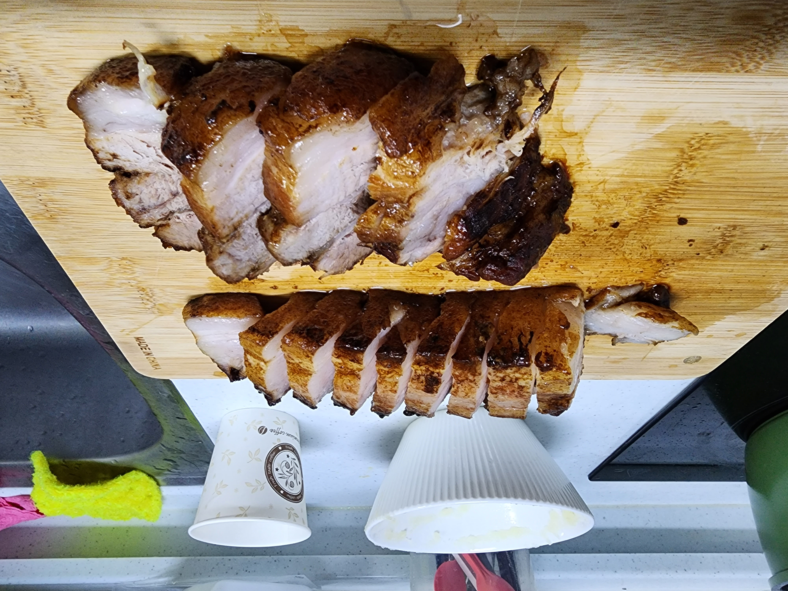

# 마늘 콜라 수육

> 재료가 매우 간단한 `마늘 콜라 수육` 레시피

## 재료

- 라면 냄비 - 1개
- 통 삼겹살 - 500g
  - **해동 된 것**을 사용
  - 통 삼겹살 해동 방법
    1. 냉장고에 넣어두기 - 4시간 소요
    2. 흐르는 찬물에 넣어두기 - 15 ~ 30분 정도 소요

- 콜라 - 종이컵 3컵 
  - 김빠져도 상관 X
- 진간장 - 종이컵 1컵
- 깐 마늘 또는 다진 마늘 - 먹을 만큼
  - 깐 마늘의 경우 직접 다져줘야하는데, 다진 마늘보다 덜 맵고 알싸한 맛이 약하다고 합니다. 마늘의 맛을 선호하지 않는다면 깐 마늘로 직접 다지는걸 추천합니다.
- 양배추 - 대충 한줌
- 물 - 6 보통 숟갈
- 소금 - 조금 (2 작은 숟갈)
- 설탕 - 많이 (4 아빠 숟갈)
- ★(익은) 배추 김치★ - 먹을 만큼
  - 엄청난 복병

## 요리 방법

### 콜라 수육

1. 물기 없는 냄비를 중불에 `5분간` 달궈줍니다.
2. 통 삼겹살을 **`껍데기`가 바닥에 닿도록** 냄비에 넣고 `15분간` **튀기 듯**이 익혀줍니다.
   - 껍데기 쪽에 지방이 많아 기름이 많이 나옵니다. 그럼 그 기름에 의해 고기가 튀겨지는데 짱 맛있습니다.
3. 이제 삼겹살을 각 면마다 `6분`씩 돌려가며 `2.`에서 나온 기름에 튀기 듯 익혀줍니다.
4. 기름을 유지한채 냄비에 `콜라를 종이컵 3컵` 넣고, `진간장 종이컵 1컵`을 넣습니다.
   - 콜라:진간장 => 3:1 비율
   - 대충 고기가 잠길랑 말랑한 수준으로 비율 맞춰 넣어주면 됩니다. 
5. 이제 `약 2시간` 정도 콜라와 간장이 충분이 쫄아들어 고기에 밸때까지 기다립니다.
6. 완료되면 수육을 먹기 좋게 썰어줍니다.

### 마늘 양념

> 콜라 수육이 될 때 동안 마늘 양념을 준비합니다.
>
> 마늘에 많은 설탕과 양배추가 들어가 마늘 특유의 엄청난 알싸한 맛을 잡아줍니다.
>
> PS. 마늘을 다진 마늘로 만들기 전, 전자레인지에 돌려 익혀주면 더 알싸한 맛이 약해질지도? (안해봄)

1. 양배추를 씻어줍니다.

2. 양배추를 갈아줍니다.

3. 간 양배추를 채에 고루 펴서 `30분` 정도 물기를 제거해줍니다.

   ```
    \       (채)         /
     \                 /
      \=-=-=양배추=-=-=/
       ```````````````
          \ (그릇) /
           ```````
   ```

4. 물기 뺀 간 양배추에 `소금을 1 작은 숟갈`만큼 넣고 섞어 줍니다.

5. **준비한 마늘이 다진 마늘**이라면 `9.`로 넘어갑니다.

6. 깐 마늘의 꼬다리를 썰어줍니다.

7. 꼬다리가 짤린 깐 마늘을 다진 마늘로 만들어줍니다.

   - 깐 마늘 => 다진 마늘 만드는 방법

     1. 믹서기를 준비한다.

     2. 믹서기에 마늘을 넣는다

     3. 믹서기를 돌린다
     4. 끝
        - 더욱 다양한 방법은 유튜브 참고

8. 이제 다진 마늘을 채를 이용해 물기를 어느정도 덜어줍니다.
9. 다진 마늘에 `설탕을 4 아빠 숟갈`, `소금 1 작은 숟갈`, `물 6 보통 숟갈`을 넣고 잘 섞어줍니다.
10. `9.`에서 만든 **다진 마늘이엇던 무언가**에 `4.`에서 만든 **물기 뺀 양배추**를 넣고 잘 섞어줍니다.
11. `3.`과 같이 채에 `10.`에서 만든 양념을 고루 펴서 물기를 제거해줍니다.
12. 끝

## 먹는 방법

1. 방법 1 - 콜라 수육, 마늘 양념 (근본 조합)

   > 근본은 틀리지 않았다. (다만 마늘 맛이 좀 많이 남)

   ```
       마양
       ---
       콜수
   ---\___/ <= 숟가락
   ```

2. 방법 2 - 콜라 수육, 김치 (김치의 아삭한 식감과 감칠맛 + 콜라 수육의 풍미)

   > 개인적으로 제일 맛있는 조합이었다.

   ```
       김치
       ---
       콜수
   ---\___/ <= 숟가락
   ```

3. 방법 3 - 콜라 수육, 김치, 마늘 양념 (말이 필요 없음)

   > 김치의 아삭한 식감 + 마늘 양념의 단맛과 알싸한 맛 + 콜라 수육의 풍미가 어우러져 맛있었음.

   ```
       마양
       ---
       김치
       ---
       콜수
   ---\___/ <= 숟가락
   ```

## 결과

- 콜라 수육



- 콜라 수육, 김치, 마늘 양념


## 최종

- 맛 : ★★★★★
- 재료비 : ★★★★★
  - 통 삼겹살 500g : 7,000원
    - 1kg에 14,000원 짜리 통삼겹살 구매
  - 깐 마늘 10알 * 2 : 1200원 * 2
  - 양배추 1/6개 : 1600원 
- 시간 : ★☆☆☆☆

- 최종 후기 : 재료 비용도 얼마 안들고 엄청 맛있었다. 하지만 만드는 시간이 너무 오래 걸린다는 점이 좀 아쉽다...

## 참고

- 자취요리신 유튜브 - 외국인 100중 88명이 보면 기겁할 초간단 보쌈 만들기
  - https://www.youtube.com/watch?v=oBXKTqGHc_0

- 1분요리 뚝딱이형 유튜브 - 외국인들이 보면 놀라서 쓰러지는 한국 음식 압도적 1위
  - https://www.youtube.com/watch?v=059AWLsr7xc

- ★엄마★ 

  
